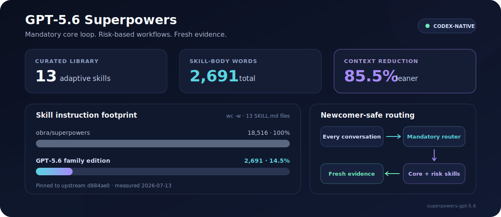

# Superpowers for GPT-5.6

<p align="center">
  <strong>A lean, newcomer-safe Superpowers profile built specifically for Codex CLI.</strong>
</p>

<p align="center">
  <a href="README.zh-TW.md">繁體中文</a> ·
  <a href="GUIDE.md">English Guide</a> ·
  <a href="GUIDE.zh-TW.md">繁體中文指南</a> ·
  <a href="skills/superpowers">Browse Skills</a>
</p>



This repository is a Codex-native edition of [obra/superpowers](https://github.com/obra/superpowers/tree/main/skills), tailored for the GPT-5.6 family.

## Install and quick start

This repository contains a bundle of 13 skills. Install each directory directly under [`skills/superpowers`](skills/superpowers) as a separate skill; the parent directory is not itself a skill.

### Install manually

The following setup works in macOS, Linux, WSL, and Git Bash. It keeps the clone outside the discovery directory, then symlinks each skill into the [Codex user skills directory](https://developers.openai.com/codex/skills):

```bash
set -eu

repo="$HOME/.agents/superpowers-gpt-5.6"
skills_dir="$HOME/.agents/skills"

git clone --depth 1 https://github.com/eagleagentic/superpowers-gpt-5.6.git "$repo"
mkdir -p "$skills_dir"

for skill in "$repo"/skills/superpowers/*; do
  [ -f "$skill/SKILL.md" ] || continue
  target="$skills_dir/$(basename "$skill")"
  if [ -e "$target" ] || [ -L "$target" ]; then
    echo "Refusing to overwrite existing skill: $target" >&2
    exit 1
  fi
done

for skill in "$repo"/skills/superpowers/*; do
  [ -f "$skill/SKILL.md" ] || continue
  ln -s "$skill" "$skills_dir/$(basename "$skill")"
done
```

The preflight check stops before creating any skill links when a same-named installation already exists.

### Ask an AI to install it

Paste this into Codex:

```text
Use $skill-installer to install every direct child directory containing SKILL.md from
https://github.com/eagleagentic/superpowers-gpt-5.6/tree/main/skills/superpowers.
Install all 13 skills; do not install skills/superpowers as a single skill.
```

### Verify and update

Open `/skills` and confirm that the 13 skills appear, then invoke `$using-superpowers` in a new turn. Codex detects newly installed skills automatically; restart Codex if they do not appear.

For a manual installation, update the clone with:

```bash
git -C "$HOME/.agents/superpowers-gpt-5.6" pull --ff-only
```

The symlinks continue to point at the updated skill directories.

## Why this repository exists

Our team initially used obra/superpowers directly. In our day-to-day Codex CLI and GPT-5.6 family workflows, we observed noticeably slower iteration: mandatory skill activation, longer instructions, and fixed process chains added coordination latency and token overhead. This is an account of our practical experience in those workflows, not a general latency benchmark across every platform.

We created this tailored edition to keep the upstream engineering disciplines that improve outcomes while fitting the capabilities Codex already provides natively. Its instructions are compressed, and its router enforces a lightweight core loop for every non-mechanical implementation while loading extra process skills only when risk justifies them. The resulting skill bodies contain **2,691 words versus 18,516 upstream—a reduction of 85.5%**.

> **The key difference:** `using-superpowers` still starts with every conversation. It enforces a mandatory lightweight implementation loop—not a universal durable-artifact chain.

> **Delegation boundary:** Codex Ultra provides native subagent delegation by default, so this bundle removes its separate agent-dispatch skills and templates instead of duplicating Codex's orchestration layer.

## Why this edition

| Adaptive by default | Codex-native | Proportional rigor |
| :--- | :--- | :--- |
| Supplies safe workflow defaults even when users name no skills. | Uses native planning, Codex Ultra subagent delegation, approvals, and shared-workspace semantics. | Requires plan, focused coverage/checks, and diff review for non-mechanical implementations; adds safeguards by risk. |

| Lean context | Lower coordination cost | Safer boundaries |
| :--- | :--- | :--- |
| Uses 2,691 words across 13 skill bodies—85.5% fewer than upstream. | Keeps mandatory core discipline inline; durable artifacts remain risk-based. | Preserves user changes and requires authority for destructive or externally visible actions. |

## Compared with obra/superpowers

| Area | GPT-5.6 family edition | obra/superpowers |
| --- | --- | --- |
| Conversation startup | Always starts a newcomer-safe workflow router | Always checks and invokes applicable skills |
| Skill selection | Mandatory core implementation loop; extra workflows are risk-triggered | Mandatory workflows and ordered skill transitions |
| Brainstorming | Used for ambiguous, high-impact choices | Required before every creative or behavior-changing task |
| Planning | Brief plan for every non-mechanical implementation; durable plans for High-risk or resumable coordination | Comprehensive plans with fine-grained steps and frequent commits |
| TDD | Selected without user jargon when a cheap red test disambiguates implementation or captures a confirmed regression | Hard gate for nearly every feature, fix, and refactor |
| Subagents and review | Codex Ultra owns native delegation; the bundle has no dispatch templates | Fresh agents and staged reviews are central to the default workflow |
| Worktrees and delivery | Created only when isolation is requested or materially useful | Integrated into the standard implementation workflow |
| Verification | Focused checks and final diff review are mandatory; separate gates are risk-based | Universal completion gate |
| Target environment | Codex CLI with the GPT-5.6 family | Multiple agent harnesses |

The comparison is pinned to upstream commit [`d884ae0`](https://github.com/obra/superpowers/tree/d884ae04edebef577e82ff7c4e143debd0bbec99/skills). Counts were measured with `wc -w` across the 13 `SKILL.md` files on 2026-07-13: **2,691 words here versus 18,516 upstream**.

## Explore the skills

- Read the [English skill guide](GUIDE.md) or [Traditional Chinese guide](GUIDE.zh-TW.md).
- Browse the tailored bundle in [`skills/superpowers`](skills/superpowers).
- Review the always-on router in [`using-superpowers`](skills/superpowers/using-superpowers/SKILL.md).

Validate the context budget after changing the bundle:

```bash
bash skills/superpowers/check-context-budget.sh
```

The sync script protects this tailored profile and requires an explicit `--replace-tailored` flag before replacing it with upstream skills.

## Upstream credit

This project is adapted from Jesse Vincent's [obra/superpowers](https://github.com/obra/superpowers). The narrower Codex focus, adaptive routing policy, compressed instructions, and Codex-specific tooling are what make this edition a better fit for the GPT-5.6 family.
