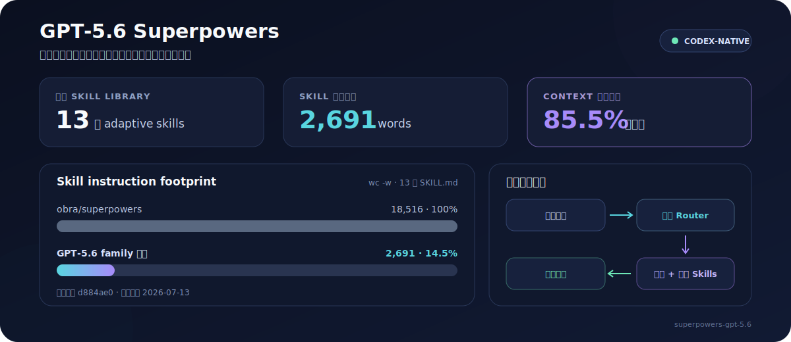

# 適用於 GPT-5.6 的 Superpowers

<p align="center">
  <strong>專為 Codex CLI 打造的精簡、newcomer-safe Superpowers profile。</strong>
</p>

<p align="center">
  <a href="README.md">English</a> ·
  <a href="GUIDE.zh-TW.md">繁體中文指南</a> ·
  <a href="GUIDE.md">English Guide</a> ·
  <a href="skills/superpowers">瀏覽 Skills</a>
</p>



這個 repository 是 [obra/superpowers](https://github.com/obra/superpowers/tree/main/skills) 的 Codex-native 版本，專為 GPT-5.6 family 調整。

## 安裝與快速設定

這個 repository 是包含 13 個 skills 的 bundle。請將 [`skills/superpowers`](skills/superpowers) 下的每個目錄分別安裝成獨立 skill；上層目錄本身不是 skill。

### 人工安裝

以下設定適用於 macOS、Linux、WSL 與 Git Bash。它會將 clone 保留在 discovery directory 之外，再把每個 skill symlink 到 [Codex user skills directory](https://developers.openai.com/codex/skills)：

```bash
set -eu

repo="$HOME/.agents/superpowers-gpt-5.6"
skills_dir="$HOME/.agents/skills"

git clone --depth 1 https://github.com/eagleagentic/superpowers-gpt-5.6.git "$repo"
mkdir -p "$skills_dir"

for skill in "$repo"/skills/superpowers/*; do
  [ -f "$skill/SKILL.md" ] || continue
  target="$skills_dir/$(basename "$skill")"
  if [ -e "$target" ] || [ -L "$target" ]; then
    echo "Refusing to overwrite existing skill: $target" >&2
    exit 1
  fi
done

for skill in "$repo"/skills/superpowers/*; do
  [ -f "$skill/SKILL.md" ] || continue
  ln -s "$skill" "$skills_dir/$(basename "$skill")"
done
```

若已存在同名 skill，preflight check 會在建立任何 skill links 前停止，不會覆寫現有安裝。

### 請 AI 安裝

將以下內容貼到 Codex：

```text
Use $skill-installer to install every direct child directory containing SKILL.md from
https://github.com/eagleagentic/superpowers-gpt-5.6/tree/main/skills/superpowers.
Install all 13 skills; do not install skills/superpowers as a single skill.
```

### 驗證與更新

開啟 `/skills` 並確認 13 個 skills 都已出現，再於新的 turn 中啟用 `$using-superpowers`。Codex 會自動偵測新安裝的 skills；若沒有出現，請重新啟動 Codex。

人工安裝可以使用以下指令更新 clone：

```bash
git -C "$HOME/.agents/superpowers-gpt-5.6" pull --ff-only
```

Symlinks 會持續指向更新後的 skill directories。

## 為何建立這個 repository

我們的團隊最初直接使用 obra/superpowers。在日常 Codex CLI 與 GPT-5.6 family workflows 中，我們實際觀察到 iteration 明顯變慢：mandatory skill activation、較長的指令及固定 process chains 增加了協調 latency 與 token overhead。這是我們在上述 workflows 中的實際使用觀察，不是涵蓋所有平台的通用 latency benchmark。

因此，我們建立這個 tailored edition：保留上游能改善成果的工程紀律，同時配合 Codex 已具備的原生能力。它壓縮 instructions，並由 router 強制所有非 Mechanical implementation 執行輕量核心流程，只在風險足以支持時載入額外 process skills。目前 skill bodies 為 **2,691 words，相較上游的 18,516 words 精簡 85.5%**。

> **關鍵差異：** `using-superpowers` 仍會在每次對話開始時啟動。它強制輕量 implementation loop，而不是強制所有工作建立 durable artifacts。

> **Delegation 邊界：** Codex Ultra 預設提供 native subagent delegation，因此這個 bundle 移除獨立的 agent-dispatch skills 與 templates，不重複 Codex 的 orchestration layer。

## 為何選擇本版

| Adaptive by default | Codex-native | 與風險成比例的嚴謹度 |
| :--- | :--- | :--- |
| 即使使用者沒有點名 skills，也會提供安全 workflow defaults。 | 使用原生 planning、Codex Ultra subagent delegation、approvals 與 shared-workspace semantics。 | 非 Mechanical implementation 必須有 plan、focused coverage/checks 與 diff review；再依風險加入 safeguards。 |

| 精簡 context | 更低的協調成本 | 更安全的授權邊界 |
| :--- | :--- | :--- |
| 13 個 skill bodies 合計 2,691 words，比上游少 85.5%。 | 強制核心紀律 inline 執行；durable artifacts 維持風險導向。 | 保留使用者既有變更；破壞性或對外可見的操作必須先取得授權。 |

## 與 obra/superpowers 比較

| 面向 | GPT-5.6 family 版本 | obra/superpowers |
| --- | --- | --- |
| 對話開始 | 每次啟動 newcomer-safe workflow router | 每次檢查並啟用適用 skills |
| Skill 選擇 | 強制核心 implementation loop；額外 workflows 由風險觸發 | Mandatory workflows 與有序 skill transitions |
| Brainstorming | 用於模糊且高影響的選擇 | 所有 creative 或 behavior-changing 任務開始前都必須使用 |
| Planning | 每個非 Mechanical implementation 都要 brief plan；High-risk 或 resumable coordination 才寫 durable plan | 完整計畫、細粒度步驟與頻繁 commits |
| TDD | 不需使用者懂術語；便宜的 red test 能區分實作或捕捉已確認 regression 時自動選用 | 幾乎所有 feature、fix 與 refactor 的 hard gate |
| Subagents 與 review | Codex Ultra 負責 native delegation；bundle 不提供 dispatch templates | Fresh agents 與 staged reviews 是預設流程核心 |
| Worktrees 與交付 | 明確要求或隔離有實質價值時才建立 | 標準 implementation workflow 的一部分 |
| Verification | 聚焦 checks 與 final diff review 必須執行；獨立 gate 依風險使用 | Universal completion gate |
| 目標環境 | Codex CLI 與 GPT-5.6 family | 多種 agent harnesses |

比較基準固定為上游 commit [`d884ae0`](https://github.com/obra/superpowers/tree/d884ae04edebef577e82ff7c4e143debd0bbec99/skills)。2026-07-13 使用 `wc -w` 量測雙方 13 個 `SKILL.md`：**本版 2,691 words，上游 18,516 words**。

## 探索 Skills

- 閱讀 [繁體中文技能指南](GUIDE.zh-TW.md) 或 [English skill guide](GUIDE.md)。
- 瀏覽 [`skills/superpowers`](skills/superpowers) 內的 tailored bundle。
- 查看每次對話都會啟動的 [`using-superpowers`](skills/superpowers/using-superpowers/SKILL.md) router。

修改 bundle 後，執行 context-budget 驗證：

```bash
bash skills/superpowers/check-context-budget.sh
```

Sync script 會保護這份 tailored profile；只有明確傳入 `--replace-tailored` 才會以 upstream skills 取代它。

## 上游致謝

本專案改作自 Jesse Vincent 的 [obra/superpowers](https://github.com/obra/superpowers)。更聚焦的 Codex 定位、adaptive routing policy、精簡指令與 Codex-specific tooling，正是本版更適合 GPT-5.6 family 的原因。
